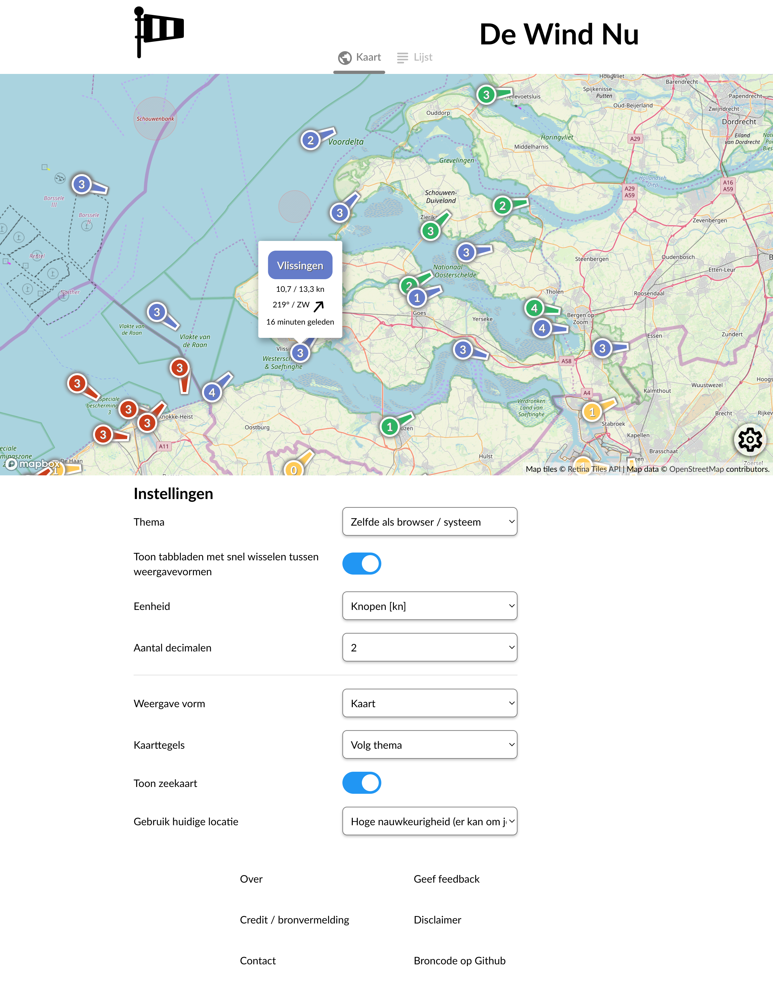
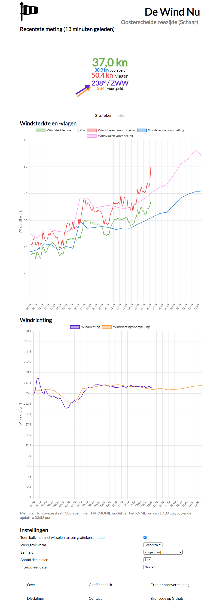

# De Wind Nu
De Wind Nu verzamelt actuele windmetingen van meetstations door heel Nederland en visualiseert deze samen met voorspellingen in grafieken. 
Deze kunnen gebruikt worden voor het informeren van surfers of zeilers. Het [changelog](CHANGELOG.md) is hier te bekijken.

## Homepagina
Bij het openen van de website is het volgende overzicht weergegeven met de wind- snelheden en richtingen in Beaufort. 

## Wind pagina
Na het klikken op een van de locaties wordt de data van de dezelfde dag getoond voor deze locatie.

Meer informatie over hoe de site werkt is te vinden op https://dewindnu.nl#over