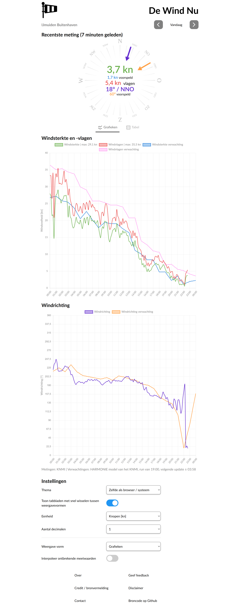

# De Wind Nu
De Wind Nu verzamelt actuele weerdata van meetstations door heel Nederland. Deze kunnen gebruikt worden voor het informeren van surfers of zeilers.

## Homepagina
Bij het openen van de website is het volgende overzicht weergegeven met de wind- snelheden en richtingen in Beaufort. 

Opties zoals als de kaart tegels, met keuze tussen de standaardtegels van OpenStreetMap en tegels van hogere resolutie van Mapbox, kunnen onderaan veranderd worden (scroll op de witte balk bovenaan). Ook kan er een zeekaart toegevoegd worden.

## Wind pagina
Na het klikken op een van de locaties wordt de data van de dezelfde dag getoond voor deze locatie.

Bovenaan zijn de naam van de locatie en de bron weergegeven. Onder het eerste kopje zijn de gegevens van de recentste meting weergegeven. Daaronder is een grafiek te zien met de gemeten windsnelheden (gemiddelde snelheid over de afgelopen 10 minuten) en de windvlagen (maximale, 3 seconde durende, windstoot in de afgelopen 10 minuten). Eronder is nog een grafiek weergegeven met de gegevens over de windrichting (windrichting ten opzichte van het ware Noorden), indien deze beschikbaar zijn. Tenslotte zijn onderaan nog wat instellingen weergegeven. Zo kunnen bijvoorbeeld de eenheden of het aantal decimalen gewijzigd worden. Ook is het mogelijk de data te laten interpoleren.

## Fouten / bugs
Het gebeurt regelmatig dat je een fout (in rode tekst) krijgt tijdens het gebruik van de website. Indien dit het geval is, is dit een probleem buiten het bereik van De Wind Nu. Andere problemen, zoals het niet laden van de website na 10 seconden, waarden van <i>undefined</i>, <i>NaN</i> of negatieve getallen die getoond worden, of het ontbreken van elementen op de website, zijn bugs en deze kunnen gerapporteerd worden met het formulier onderaan de website.